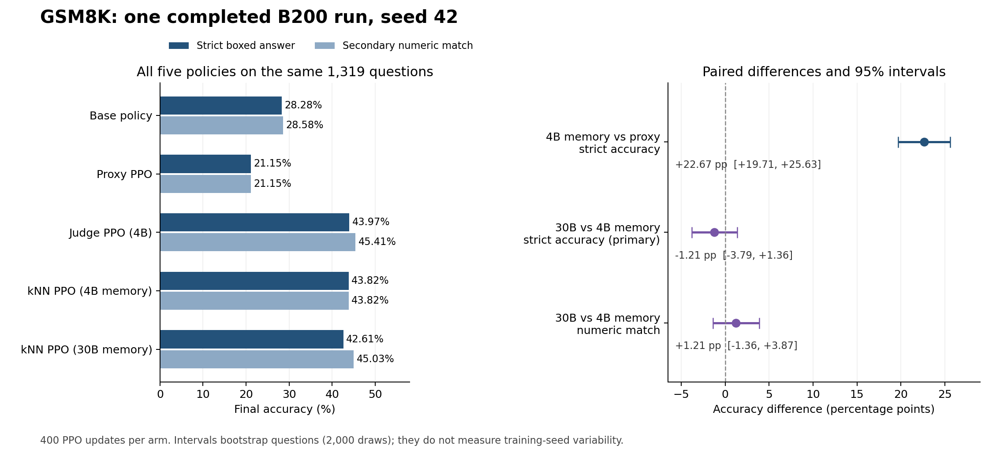

# GSM8K B200 results: completed seed 42

The 4B-memory kNN arm substantially improved final strict accuracy over
proxy-only PPO: **43.82% versus 21.15%**, a **+22.67 percentage-point** difference
with a paired question-bootstrap 95% interval of **[+19.71, +25.63]**.
The primary comparison between 30B- and 4B-labeled memories did **not** show a
clear improvement from the larger teacher in this run.

This analysis uses the uploaded `gsm8k_outputs.zip`, containing a completed
full run on one NVIDIA B200: seed 42, four reward arms, and 400 successful PPO
updates per arm. It describes one training seed, not a multi-seed result.

The subsequent [reward and metric bug audit](B200_REWARD_BUG_AUDIT.md) replayed
all 25,600 terminal rewards and 19,907 kNN predictions from the original cache.
The checks found no reward-sign, normalization, cache-alignment or teacher-routing
error. It also adds the previously missing reward/correctness comparison:
on identical validation answers, AUROC rises from **0.7178** for the proxy to
**0.8788** for the 4B-corrected reward. This is a different target from detecting
large proxy-judge gaps; the original gap metrics remain unchanged. See the
[expanded validation report](b200_seed42/validation_v2/report.md).



Download the figure as [SVG](b200_seed42/final_comparison.svg) or
[PNG](b200_seed42/final_comparison.png). The underlying
[final metrics](b200_seed42/final_metrics.csv) and
[verified audit summary](b200_seed42/verified_summary.json) are tracked with this report.

## Final accuracy

All policies answer the same **1,319 official test questions**, using greedy
decoding. Every row is a Qwen2.5-0.5B policy; 4B and 30B describe the reward
models or memory-labeling teachers, not the size of the evaluated policy.

| Policy | Strict correct / all | Strict accuracy | Secondary numeric matches / all | Numeric match rate | Unresolved numeric answers |
|---|---:|---:|---:|---:|---:|
| Base, no PPO | 373 / 1,319 | 28.28% | 377 / 1,319 | 28.58% | 30 |
| Proxy PPO | 279 / 1,319 | 21.15% | 279 / 1,319 | 21.15% | 17 |
| Judge PPO, 4B reward | 580 / 1,319 | **43.97%** | 599 / 1,319 | **45.41%** | 32 |
| kNN PPO, 4B memory | 578 / 1,319 | 43.82% | 578 / 1,319 | 43.82% | **11** |
| kNN PPO, 30B memory | 562 / 1,319 | 42.61% | 594 / 1,319 | 45.03% | 50 |

Strict accuracy requires exactly one parseable numeric boxed answer matching
the reference. The secondary numeric protocol can recover a clear final value
outside that strict format. Unresolved responses remain in the denominator;
they are not discarded to increase accuracy. Neither metric validates the
reasoning or the interpretation of units.

### Comparisons already reported by the run

| Comparison | Strict accuracy difference, percentage points | Paired 95% interval |
|---|---:|---:|
| Judge PPO minus proxy PPO | +22.82 | [+19.79, +25.85] |
| 4B-memory kNN minus proxy PPO | +22.67 | [+19.71, +25.63] |
| 30B-memory kNN minus proxy PPO | +21.46 | [+18.57, +24.49] |
| **30B-memory kNN minus 4B-memory kNN: primary teacher comparison** | **−1.21** | **[−3.79, +1.36]** |

For the primary teacher comparison, the secondary numeric metric changes the
point estimate to **+1.21 pp**, but its interval **[−1.36, +3.87]** also includes
zero. The data therefore do not establish an advantage for the 30B memory.
They also do not establish that the two methods are equivalent.

The memory comparison is matched: both arms use the same 512 memory questions,
the same 1,024 answers and proxy embeddings, k = 32, temperature 0.05, and the
same training question schedule. The gap labels and teacher normalization
change. The 30B teacher is used during preparation; the 1.5B proxy and frozen
memory supply that arm's PPO reward. Final diagnostic grading uses the common
4B judge; 30B final grading was disabled.

### Additional comparisons computed for this analysis

These are exploratory additions to the saved report, using the same paired
bootstrap implementation, 2,000 resamples, and seed 42:

| Comparison | Strict difference, percentage points | Paired 95% interval |
|---|---:|---:|
| Proxy PPO minus base | −7.13 | [−9.48, −4.78] |
| 4B-memory kNN minus base | +15.54 | [+12.89, +18.35] |
| 4B-memory kNN minus judge PPO | −0.15 | [−3.03, +2.81] |

The 4B-memory arm gains **299 correct answers over proxy PPO** and **205 over
the base policy**. Its strict result is numerically close to judge PPO, with
no resolved difference in this comparison; this is not an equivalence test.
Proxy PPO's mean proxy grade rises from 4.382 for the base policy to 4.452,
while its numeric task accuracy falls. This pattern is consistent with reward
misalignment, but does not by itself identify a particular reward-hacking mechanism.

All intervals resample questions conditional on these trained policies. They
do not estimate variation across training seeds, and the comparisons are not
adjusted for multiple testing. The source report states that this is a
follow-up on a previously inspected benchmark, with the numeric protocol frozen
before this suite; it should not be described as a wholly untouched benchmark study.

## Formatting explains part of the 30B result

| Policy | Valid boxed-answer rate | Length-capped answers | Mean answer tokens |
|---|---:|---:|---:|
| Base | 96.21% | 20 / 1,319 | 105.4 |
| Proxy PPO | 98.64% | 10 / 1,319 | 72.3 |
| Judge PPO | 95.07% | 19 / 1,319 | 255.9 |
| 4B-memory kNN | **99.17%** | **4 / 1,319** | 174.0 |
| 30B-memory kNN | 92.04% | 24 / 1,319 | 252.5 |

The numeric extractor recovers 32 additional correct answers for the 30B-memory
arm and 19 for judge PPO; it recovers none for the 4B-memory arm. This accounts
for the change in ranking between strict and secondary numeric results.
The 30B-memory arm also has 50 unresolved numeric answers, so its formatting
and extraction behavior should be reported alongside its numeric match rate.
The current run applied zero format and incomplete-answer reward penalties.

## Actual data and training counts

| Item | Verified count |
|---|---:|
| Training seed / data-split seed | 42 / 42 |
| Reserved questions from the training split | 6,408 |
| Training-source questions outside all reserved cohorts | 1,065 |
| Calibration | 128 questions, 256 answers |
| Initial kNN memory | 512 questions, 1,024 answers in each matched memory |
| Selection diagnostics | 128 questions, 256 answers |
| PPO pool | 5,000 questions |
| PPO questions actually visited | 3,200 per arm; the same schedule in all arms |
| PPO answers | 6,400 per arm; **25,600 total** |
| Successful PPO updates | 400 per arm; **1,600 total** |
| Skipped PPO updates / excluded PPO answers | **0 / 0** |
| Monitoring | 65 evaluations × 128 answers = **8,320** |
| Final evaluation | 5 policies × 1,319 answers = **6,595** |
| Memory refresh | None; all four arms use the static/default setup |

The monitor total includes the base policy once and 16 checkpoints per trained
arm. The final checkpoint is the declared update-400 endpoint, not a checkpoint
chosen for its best monitor score. The preparation answer set has 1,536 examples
(256 + 1,024 + 256); the 30B teacher relabels it without generating another set.
Both memory files contain identical 1,024 × 1,536 embedding matrices and question
IDs. These are recorded answer slots; repeated answer text or scorer cache hits
do not create additional unique questions.

All preparation labels were available. Two proxy-grading cases exhausted
retries during **4B-memory monitoring at updates 150 and 350**. Each affected
one of 128 monitoring answers. Both were retained in the review queue; their
numeric accuracy still counted. **No training reward or final-test grade was
missing**, and all arms completed normally. The missing-grade handling therefore
continued the run as intended.

The cost log records 1,536 fresh 30B preparation grades. For training rewards,
judge PPO requested 6,400 4B grades; each proxy/kNN arm requested 6,400 proxy
grades. The kNN arms made no 4B/30B training-reward calls. Evaluation still
called the common judge, and retries/cache hits change actual forward-pass
counts. These counters are not an end-to-end cost or speed benchmark.

See [EXPERIMENT_DATA_COUNTS.md](../EXPERIMENT_DATA_COUNTS.md#5-gsm8k-b200-experiment)
for the full cohort allocation and the distinction between configured budgets
and realized counts.

## Diagnostic limitation: the high-gap threshold is saturated

The report's 0% high-gap rate is **uninformative in this run**. Both scorers
produce grades from 1 to 5. Using the saved normalization, the largest possible
proxy-minus-judge gap is:

```text
max_gap = (5 - proxy_mean) / proxy_std - (1 - judge_mean) / judge_std
        = 1.9198088541157206
```

The saved calibration threshold is exactly **1.9198088541157206**, and the
implementation labels a case high-gap only when `gap > threshold`. Consequently,
no valid score pair can exceed the threshold. All final rows have zero positive
labels and AUROC is undefined. This does not demonstrate elimination of reward
hacking. It does not change the independently checked strict/numeric accuracy
results or continuous gap-regression errors.

The completed run and its frozen scores remain as recorded. Changing the cutoff
after inspecting these answers would be a separately labeled diagnostic analysis.

The subsequent [exploratory threshold analysis](B200_THRESHOLD_ANALYSIS.md)
uses calibration and selection data to compare alternatives. For the 4B
upper-tail diagnostic, `gap > 1.2097379800099946` (Q90) gives selection AUROC
0.731 and final AUROC 0.691 on the 4B-memory policy's answers. Including ties
at the original Q95 gives the same labels. This reanalysis is separate from
the frozen run metrics and does not alter training or accuracy results.

The integrated [validation report](b200_seed42/validation/report.md) also
measures continuous prediction quality. On selection, the 4B predictor has
gap MSE **1.2621** and gap R2 **0.0953**; the 30B predictor has gap MSE
**1.1942** and gap R2 **0.0883**, against their respective teacher targets.
On the 4B-memory policy's final answers, the common 4B predictor has gap MSE
**1.0550** and gap R2 **0.1350**. Gap regression is modest despite useful
high-gap ranking. Corrected-judge R2 is a different target and is negative in
these evaluations; both definitions are retained in the report.

## Provenance and checks

Source archive: `gsm8k_outputs.zip`, 305,042,263 bytes, 3,551 entries.

```text
Archive SHA-256:
c3b05d0ca5911daf7a3d77b67d34889c274154281c3973db36644def7baecdba

Run fingerprint:
dd521bd88f6e3451369b17cb94572ea29a108f386fcd17b61159afd45dc23c37
```

Archive CRCs, manifest identity, split identity, disjoint cohorts, matched memory
embeddings, and teacher-preparation file hashes were checked. All 25,600 saved
rollout rows were counted and their question schedules compared. All 6,595 final
answers were reparsed with the existing strict and numeric extractors; all five
final metric sets and all eight saved final paired intervals were reproduced.

The [audit JSON](b200_seed42/verified_summary.json) records these checks, the
source/verification fingerprints, exact counts, and both saved and additional
comparisons. [Run settings](b200_seed42/run_config.json) retain the completed run's
exact configuration; the newly added diagnostic validation settings were absent
from that run. The run used the earlier recorded source revision with its
`ungraded_review_v1` amendment; it is not relabeled as a run of the later
project-layout revision.

An analysis copy of the imported reports, evaluation answers, preparation
records, and training statistics is under
[`results/gsm8k/b200`](../../results/gsm8k/b200/). That local copy omits model
checkpoints, adapters, caches, and training rollout text; the uploaded archive
is the complete source for those omitted artifacts. The local result directory
is excluded from Git. The report, compact audit, CSV tables, and figures are
tracked so they remain readable in a source-only submission.
