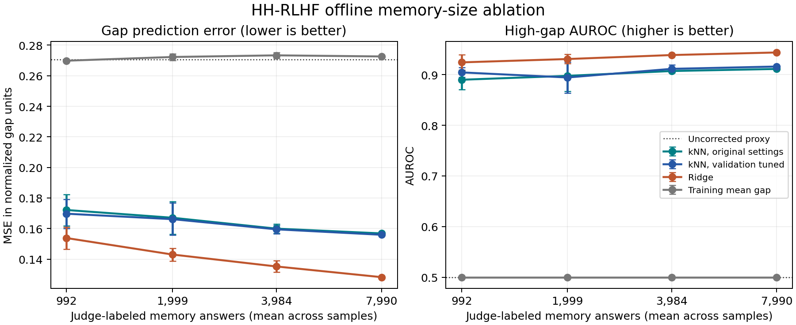

# HH-RLHF: ridge baseline and memory-size ablation

This is a retrospective offline comparison using saved proxy embeddings and actual proxy-minus-judge labels. It adds no PPO runs, model inference, generated answers or grader calls. Ridge and tuned kNN minimize MSE on the same validation answers and are frozen before evaluation.

## Label budget and partitions

The full memory contains **7,990 answers** from **1,885 normalized conversation groups**. Validation has **1,024 answers** from **512 groups**. Primary evaluation has **1,024 answers** from **512 groups**. The two held-out answers per group come from the saved raw and signed-kNN policies. These are reserved HH train-source conversations, not the official HH test split.

All methods receive identical training rows, embeddings, target labels and evaluation answers at each memory size. The proxy control uses no fitted gap labels. Ridge fits an intercept with L2 regularization on the same unit vectors, without feature-wise rescaling or test-dependent preprocessing. Validation examples are never added to fitting data.

The original normalization and high-gap threshold are inherited and fixed. Their historical calibration budget is shared by all methods and is additional to the memory-fitting budget. The upper-tail target is never changed to maximize test AUROC.

## Primary results at full memory

| Predictor | Gap MSE | Gap R2 | Gap Pearson r | High-gap AUROC | High-gap AP | Agreement with judge's pair preference |
|---|---:|---:|---:|---:|---:|---:|
| Proxy (zero gap) | 0.2705 | -0.0259 | unavailable | 0.5000 | 0.0303 | 0.7615 |
| Training mean gap | 0.2726 | -0.0339 | unavailable | 0.5000 | 0.0303 | 0.7615 |
| kNN, original settings | 0.1568 | 0.4052 | 0.6383 | 0.9114 | 0.2729 | 0.7934 |
| kNN, validation tuned | 0.1559 | 0.4086 | 0.6460 | 0.9162 | 0.2787 | 0.7780 |
| Ridge | 0.1282 | 0.5138 | 0.7187 | 0.9440 | 0.3917 | 0.8110 |

Gap MSE equals the corrected reward's MSE against normalized judge scores. R2 uses the evaluated cohort's mean as its reference and is not squared correlation. High-gap AUROC ranks predicted gaps; pair agreement instead ranks proxy_z minus predicted_gap within each conversation. Judge ties are omitted and reward ties receive half credit. Judge agreement is not verified human preference or answer correctness.

## Paired full-memory comparison

The prespecified comparison is **ridge minus validation-tuned kNN**. Negative MSE differences favor ridge; positive AUROC differences favor ridge. Intervals resample whole conversation groups, retaining every method/policy answer for each group.

| Evaluation | MSE difference | 95% interval | AUROC difference | 95% interval |
|---|---:|---|---:|---|
| test | -0.0277 | [-0.0369, -0.0186] | 0.0278 | [0.0036, 0.0584] |
| second_refresh_parent | -0.0288 | [-0.0338, -0.0242] | 0.0288 | [0.0097, 0.0500] |
| second_refresh_static | -0.0245 | [-0.0291, -0.0200] | 0.0305 | [0.0146, 0.0484] |
| second_refresh_refreshed | -0.0247 | [-0.0293, -0.0202] | 0.0377 | [0.0190, 0.0591] |

These are conditional evaluation intervals. They do not include uncertainty from fitting, hyperparameter selection, training new policies, or choosing experiments after inspecting earlier results. Transfer comparisons are exploratory and have no multiple-comparison adjustment.

## Memory-size ablation

Export: [SVG](memory_ablation.svg), [PDF](memory_ablation.pdf). Error bars show one standard deviation across three nested conversation samples, not confidence intervals and not three new PPO seeds. Full memory is identical across samples and is fitted once. Horizontal positions use actual mean answer counts; whole-group sampling makes these counts vary.

| Memory fraction | Groups per sample | Answer-count range | Predictor | Mean test MSE | Mean test R2 | Mean test AUROC |
|---|---:|---|---|---:|---:|---:|
| 12.5% | 236 | 973–1016 | kNN, original settings | 0.1721 | 0.3471 | 0.8901 |
| 12.5% | 236 | 973–1016 | kNN, validation tuned | 0.1697 | 0.3564 | 0.9046 |
| 12.5% | 236 | 973–1016 | Ridge | 0.1538 | 0.4167 | 0.9244 |
| 25.0% | 472 | 1985–2026 | kNN, original settings | 0.1671 | 0.3664 | 0.8978 |
| 25.0% | 472 | 1985–2026 | kNN, validation tuned | 0.1662 | 0.3699 | 0.8946 |
| 25.0% | 472 | 1985–2026 | Ridge | 0.1430 | 0.4576 | 0.9310 |
| 50.0% | 943 | 3962–4005 | kNN, original settings | 0.1599 | 0.3934 | 0.9073 |
| 50.0% | 943 | 3962–4005 | kNN, validation tuned | 0.1595 | 0.3951 | 0.9116 |
| 50.0% | 943 | 3962–4005 | Ridge | 0.1352 | 0.4873 | 0.9389 |
| 100.0% | 1885 | 7990–7990 | kNN, original settings | 0.1568 | 0.4052 | 0.9114 |
| 100.0% | 1885 | 7990–7990 | kNN, validation tuned | 0.1559 | 0.4086 | 0.9162 |
| 100.0% | 1885 | 7990–7990 | Ridge | 0.1282 | 0.5138 | 0.9440 |

## Transfer to saved second-refresh policies

Only full-memory predictors are evaluated here. These are still the predictors fitted to the **original memory**; they are not each policy's deployed refreshed-memory reward. Each condition combines its saved seeds 42, 43 and 44, with all answers for the same conversation kept together in uncertainty calculations. This measures transfer of an offline predictor, not the outcome of replacing a reward model and rerunning PPO.

| Policy-answer cohort | Answers / groups | Predictor | MSE | R2 | AUROC |
|---|---:|---|---:|---:|---:|
| second_refresh_parent | 6144 / 2048 | kNN, original settings | 0.1556 | 0.3706 | 0.8855 |
| second_refresh_parent | 6144 / 2048 | kNN, validation tuned | 0.1553 | 0.3715 | 0.8909 |
| second_refresh_parent | 6144 / 2048 | Ridge | 0.1265 | 0.4881 | 0.9197 |
| second_refresh_static | 6144 / 2048 | kNN, original settings | 0.1578 | 0.3559 | 0.8852 |
| second_refresh_static | 6144 / 2048 | kNN, validation tuned | 0.1565 | 0.3614 | 0.8917 |
| second_refresh_static | 6144 / 2048 | Ridge | 0.1320 | 0.4615 | 0.9222 |
| second_refresh_refreshed | 6144 / 2048 | kNN, original settings | 0.1549 | 0.3550 | 0.8785 |
| second_refresh_refreshed | 6144 / 2048 | kNN, validation tuned | 0.1545 | 0.3569 | 0.8827 |
| second_refresh_refreshed | 6144 / 2048 | Ridge | 0.1297 | 0.4599 | 0.9204 |

## Reproducibility and limits

Historical fixed-kNN MSE: **0.15681485**; CPU recomputation: **0.15682550**. There are **2** predictions differing by more than 1e-5; maximum absolute difference **0.02128066**. The shared search uses float32 cosine similarities; near-ties at the kth neighbor can change across BLAS/batching implementations. The analysis retains both the historical and recomputed values rather than silently replacing the archived predictions.

[Metrics](metrics.csv), [summary and paired intervals](summary.json), [validation candidates](validation_candidates.csv), and [input/source manifest](manifest.json). Model choices and coefficients are saved under models/ before any evaluation CSV or feature matrix is parsed. Input bytes are hashed for provenance before fitting; test metrics never select a model. Original scientific files and the shared PPO/kNN implementation are unchanged.

The runner rejects missing, changed, misaligned or overlapping inputs. It validates memory-to-bank indices, saved score normalization, conversation identities, full-answer scoring and completion hashes. Historical results may already have been inspected; this is not a newly untouched benchmark. Better offline reward prediction does not establish better PPO.

Ridge follows the [scikit-learn Ridge definition](https://scikit-learn.org/stable/modules/generated/sklearn.linear_model.Ridge.html). Selection follows the [train/test separation guidance](https://scikit-learn.org/stable/common_pitfalls.html#data-leakage).
